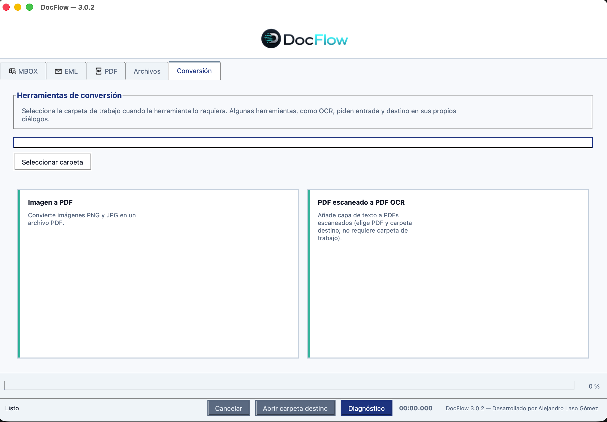
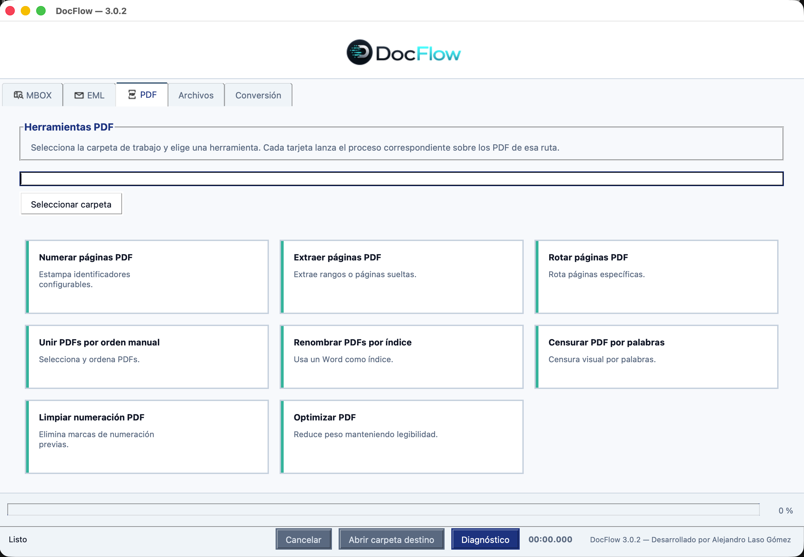
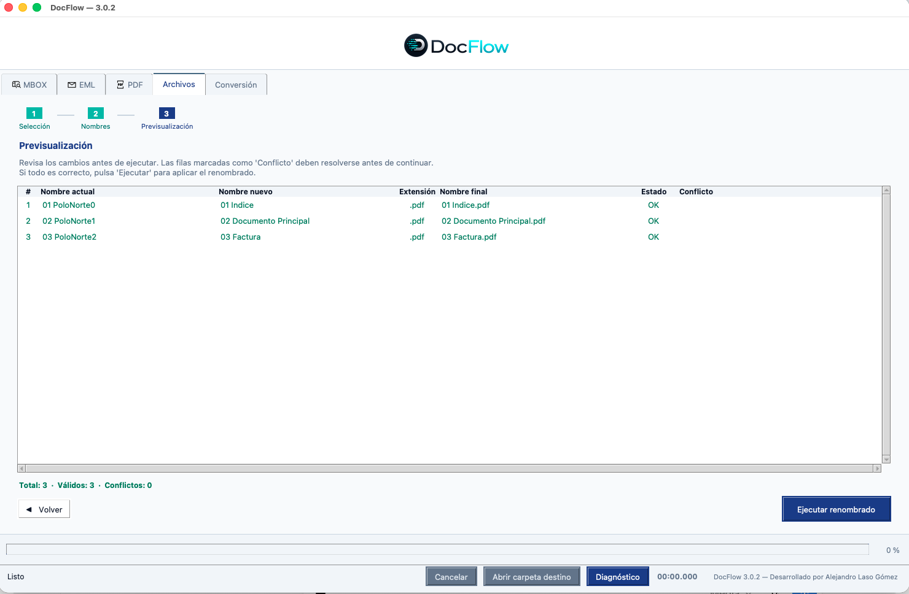
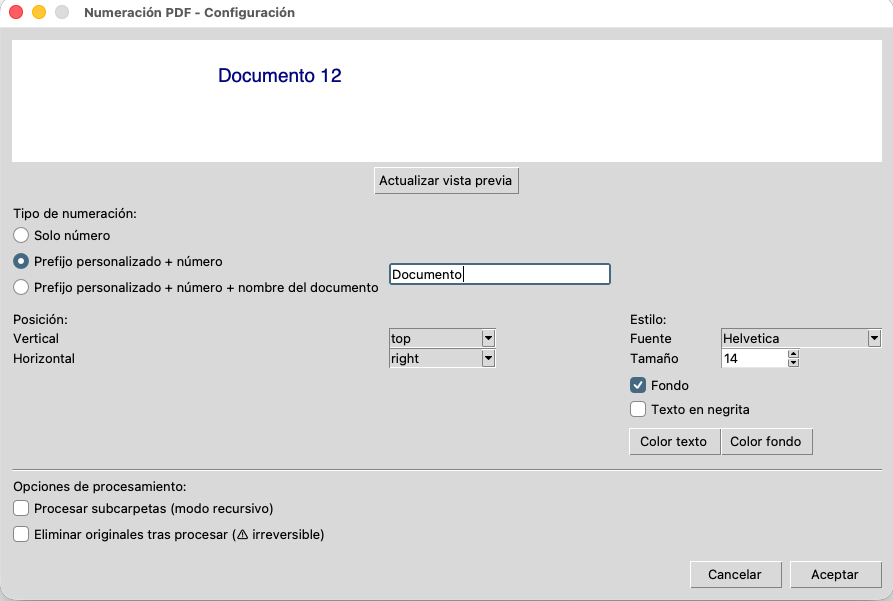

# DocFlow

DocFlow es una aplicación de escritorio profesional para la automatización y gestión documental.

Está desarrollada en **Python 3.13** con **Tkinter y ttk** y está orientada a despachos profesionales, empresas, gestorías y departamentos administrativos.

Todos los documentos se procesan **localmente en el equipo del usuario**. DocFlow no envía archivos ni contenido documental a servidores externos.

## Capturas de pantalla

### Conversión de documentos



### Herramientas PDF



### Renombrado de archivos



### Numeración de PDF



## Funcionalidades principales

### PDF

* Unión de documentos PDF.
* Extracción de páginas y rangos.
* Rotación de páginas.
* Numeración de documentos.
* Renombrado e indexación.
* División y reorganización de archivos.
* Procesamiento por lotes.

### EML

* Conversión de mensajes EML.
* Extracción de contenido y archivos adjuntos.
* Apertura de mensajes en navegadores compatibles.
* Procesamiento individual y por lotes.

### MBOX

* Procesamiento de buzones MBOX.
* Extracción y conversión de mensajes.
* Gestión de archivos adjuntos.
* Exportación organizada de resultados.

### Archivos

* Selección múltiple de archivos.
* Reordenación de elementos.
* Importación de nuevos nombres desde archivos TXT.
* Introducción de nombres mediante texto pegado.
* Validación del número de archivos y nombres.
* Conservación automática de extensiones.
* Previsualización de los cambios.
* Detección de nombres duplicados y conflictos.
* Selección de carpeta de destino.
* Copia segura sin modificación de los archivos originales.
* Ejecución con progreso y cancelación.
* Resumen final y apertura de la carpeta de resultados.

### Conversión

* Conversión de imágenes a PDF.
* Reconocimiento óptico de caracteres —OCR— en documentos escaneados.
* Conversión de documentos procesados mediante OCR a formatos de texto.

## Características técnicas

* Interfaz modular organizada por pestañas.
* Registro centralizado de herramientas.
* Ejecución de procesos en segundo plano.
* Indicadores de progreso.
* Cancelación controlada de operaciones.
* Gestión centralizada de errores.
* Registro local de incidencias.
* Apertura multiplataforma de archivos, carpetas y logs.
* Sanitización de nombres de archivo.
* Gestión de conflictos y colisiones.
* Parseo compartido de rangos PDF.
* Arquitectura desacoplada entre interfaz y lógica de procesamiento.
* Suite automatizada de pruebas con `pytest`.
* Empaquetado con PyInstaller para macOS y Windows.

## Privacidad

DocFlow está diseñado bajo un principio de procesamiento local.

* Los documentos permanecen en el equipo del usuario.
* No se requiere subir archivos a servicios externos.
* No se incluye telemetría documental.
* Los logs no deben almacenar el contenido sensible de los documentos.
* Los archivos originales no se modifican salvo que una herramienta lo indique expresamente.

## Compatibilidad

DocFlow está preparado para su distribución en:

* macOS mediante una aplicación `.app`.
* Windows mediante un ejecutable `.exe`.

Algunas funciones dependientes del sistema operativo, como la detección de navegadores o la apertura de archivos y logs, requieren validación específica en cada plataforma.

## Estructura del proyecto

```text
DocFlow/
├── main.py                 # Punto de entrada de la aplicación
├── ui/                     # Interfaz gráfica, componentes y estilos
├── scripts/                # Herramientas documentales
│   ├── common/             # Utilidades compartidas
│   ├── pdf/                # Operaciones con PDF
│   ├── eml/                # Operaciones con EML
│   ├── mbox/               # Operaciones con MBOX
│   └── registry.py         # Registro central de herramientas
├── tests/                  # Pruebas automatizadas
├── assets/                 # Iconos, logotipos y recursos
├── tools/                  # Utilidades auxiliares
├── CURSOR.md               # Reglas de desarrollo para Cursor
├── ARCHITECTURE.md         # Arquitectura y decisiones técnicas
├── TESTING.md              # Validación automática y manual
├── BUILD.md                # Guía de empaquetado
├── requirements.txt        # Dependencias de Python
└── DocFlow.spec            # Configuración de PyInstaller
```

## Requisitos

* Python 3.13.
* Dependencias incluidas en `requirements.txt`.
* Tkinter disponible en la instalación de Python.

## Instalación para desarrollo

Desde la carpeta raíz del proyecto:

```bash
python3.13 -m venv .venv
```

Activar el entorno virtual en macOS o Linux:

```bash
source .venv/bin/activate
```

Activar el entorno virtual en Windows:

```powershell
.venv\Scripts\Activate.ps1
```

Instalar las dependencias:

```bash
python -m pip install --upgrade pip
python -m pip install -r requirements.txt
```

## Ejecución

Con el entorno virtual activado:

```bash
python main.py
```

## Tests

Ejecutar la suite completa antes de integrar cambios o generar una distribución:

```bash
python -m pytest tests -v
```

Para comprobar únicamente que la interfaz puede importarse:

```bash
python -c "from ui.app import App; print('Imports OK')"
```

La validación manual y la checklist de regresión se encuentran en [TESTING.md](TESTING.md).

## Generación de builds

DocFlow utiliza PyInstaller para generar las aplicaciones distribuibles:

```bash
python -m PyInstaller DocFlow.spec --noconfirm --clean
```

Las instrucciones completas de empaquetado y validación están disponibles en [BUILD.md](BUILD.md).

## Desarrollo

Antes de realizar cambios estructurales deben revisarse:

* [CURSOR.md](CURSOR.md), que contiene las reglas de desarrollo del proyecto.
* [ARCHITECTURE.md](ARCHITECTURE.md), que documenta la arquitectura y las decisiones técnicas principales.

Los cambios deben ser pequeños, verificables, compatibles con macOS y Windows y no deben introducir dependencias de servicios externos para el procesamiento documental.

## Licencia

DocFlow es software propietario.

Copyright © 2026 Alejandro Laso Gómez. Todos los derechos reservados.

No se concede permiso para usar, copiar, modificar, distribuir, sublicenciar o crear obras derivadas de este software sin autorización previa y expresa por escrito del titular.

Consulte el archivo [LICENSE](LICENSE) para conocer las condiciones completas.